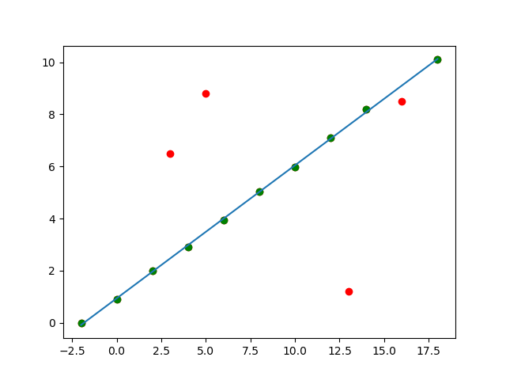
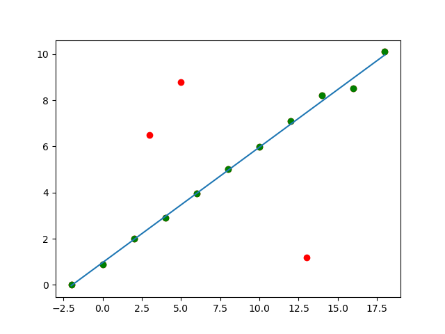

# Assignment 2

1. In the augmented Euclidean plane, there is a line $x-3y+4=0$ , what is the homogeneous  coordinate of the infinity point of this line?

   **Solution** 

   The homogeneous form of the line:
   $$
   x-3y+4z=0
   $$
   The homogeneous coordinate of the line is $(1,-3,4)$

   The homogeneous coordinate of infinity line ($z=0$) is $(0,0,1)$

   The infinity point of this line is the intersection of the line and the infinity line:
   $$
   (1,-3,4)\times (0,0,1)= (-3,-1,0)
   $$
   Therefore, the infinity point of this line is $k(3,1,0)$, where $k$ is any constant.

   

2. (Math) On the normalized retinal plane, suppose that $\mathbf{p}_{n}$ is an ideal point of projection without considering distortion. If distortion is considered, $\mathbf{p}_{n}=(x, y)^{T}$ is mapped to $\mathbf{p}_{d}=\left(x_{d}, y_{d}\right)^{T}$ which is also on the normalized retinal plane. Their relationship is,
   $$
   \left\{\begin{array}{l}
   x_{d}=x\left(1+k_{1} r^{2}+k_{2} r^{4}\right)+2 \rho_{1} x y+\rho_{2}\left(r^{2}+2 x^{2}\right)+x k_{3} r^{6} \\
   y_{d}=y\left(1+k_{1} r^{2}+k_{2} r^{4}\right)+2 \rho_{2} x y+\rho_{1}\left(r^{2}+2 y^{2}\right)+y k_{3} r^{6}
   \end{array}\right.
   $$
   where $r^{2}=x^{2}+y^{2}$
   For performing nonlinear optimization in the pipeline of camera calibration, we need to compute the Jacobian matrix of $\mathbf{p}_{d}$ w.r.t $\mathbf{p}_{n}$, i.e., $\frac{d \mathbf{p}_{d}}{d \mathbf{p}_{n}^{T}}$
   It should be noted that in this question $\mathbf{p}_{d}$ is the function of $\mathbf{p}_{n}$ and all the other parameters can be regarded as constants.
   
   **Solution**
   
   Compute the partial derivatives:
   $$
   \begin{align}
   \frac{\partial x_d}{\partial x}&=(1+k_{1} r^{2}+k_{2} r^{4})+2x^2(k_1+2k_2r^2)+2\rho_1y+6\rho_2x+k_3(r^6+6x^2r^4)\\
   &=1+k_1r^2+k_2r^4+k_3r^6+2x^2(k_1+2k_2r^2+3k_3r^4)+2\rho_1y+6\rho_2x\\
   \frac{\partial x_d}{\partial y}&=2xy(k_1+2k_2r^2)+2\rho_1x+2\rho_2y+6k_3xyr^4\\
   &=2xy(k_1+2k_2r^2+3k_3r^4)+2(\rho_1x+\rho_2y)\\
   \frac{\partial y_d}{\partial x} &=2xy(k_1+2k_2r^2+3k_3r^4)+2(\rho_1x+\rho_2y)\\
   \frac{\partial y_d}{\partial y} &=1+k_1r^2+k_2r^4+k_3r^6+2y^2(k_1+2k_2r^2+3k_3r^4)+2\rho_2x+6\rho_1y
   \end{align}
   $$
   
   $$
   \begin{align}
   \frac{d \mathbf{p}_d}{d \mathbf{p}_n^T}&=\begin{bmatrix}
   \frac{\part x_d}{\part x} & \frac{\part x_d}{\part y}\\
   \frac{\part y_d}{\part x} & \frac{\part y_d}{\part y}
   \end{bmatrix}\\
   &=\begin{bmatrix}
   1+k_1r^2+k_2r^4+k_3r^6+2x^2(k_1+2k_2r^2+3k_3r^4)+2\rho_1y+6\rho_2x \quad 2xy(k_1+2k_2r^2+3k_3r^4)+2(\rho_1x+\rho_2y)\\
   2xy(k_1+2k_2r^2+3k_3r^4)+2(\rho_1x+\rho_2y) \quad 1+k_1r^2+k_2r^4+k_3r^6+2y^2(k_1+2k_2r^2+3k_3r^4)+2\rho_2x+6\rho_1y
   \end{bmatrix}
   \end{align}
   $$
   
   
   
4. (Math) In our lecture, we mentioned that for performing nonlinear optimization in the pipeline of camera calibration, we need to compute the Jacobian of the rotation matrix (represented in a vector) w.r.t its axis-angle representation. In this question, your task is to derive the concrete formula of this Jacobian matrix. Suppose that
    $\mathbf{r}=\theta \mathbf{n} \in \mathbb{R}^{3 \times 1}$, where $\mathbf{n}=\left[\begin{array}{l}n_{1} \\ n_{2} \\ n_{3}\end{array}\right]$ is a $3 \mathrm{D}$ unit vector and $\theta$ is a real number denoting the rotation angle.
  
    With Rodrigues formula, $\mathbf{r}$ can be converted to its rotation matrix form,
    $$
    \mathbf{R}=\cos \theta \mathbf{I}+(1-\cos \theta) \mathbf{n n}{ }^{T}+\sin \theta \mathbf{n}^\and
    $$
    and obviously $\mathbf{R} \triangleq\left[\begin{array}{ccc}R_{11} & R_{12} & R_{13} \\ R_{21} & R_{22} & R_{23} \\ R_{31} & R_{32} & R_{33}\end{array}\right]$ is a $3\times 3$ matrix.
    Denote $\mathbf{u}$ by the vectorized form of $\mathbf{R}$, i.e.,
    $$
    \mathbf{u} \triangleq\left(R_{11}, R_{12}, R_{13}, R_{21}, R_{22}, R_{23}, R_{31}, R_{32}, R_{33}\right)^{T}
    $$
    Please give the concrete form of Jacobian matrix of $\mathbf{u}$ w.r.t $\mathbf{r}$, i.e., $\frac{d \mathbf{u}}{d \mathbf{r}^{T}} \in \mathbb{R}^{9 \times 3}$.
    In order to make it easy to check your result, please follow the following notation requirements, $\alpha \triangleq \sin \theta, \beta \triangleq \cos \theta, \gamma \triangleq 1-\cos \theta$
    In other words, the ingredients appearing in your formula are restricted to $\alpha, \beta, \gamma, \theta, n_{1}, n_{2}, n_{3}$.
    
    **Solution**
    
    The rotation matrix can be written in the following form
    $$
    \mathbf{R}=\begin{bmatrix}
    \cos \theta+(1-\cos \theta) n_{1}^{2}&
    (1-\cos \theta) n_{1} n_{2}-\sin \theta n_{3}&
    (1-\cos \theta) n_{1} n_{3}+\sin \theta n_{2} \\
    (1-\cos \theta) n_{1} n_{2}+\sin \theta n_{3}&
    \cos \theta+(1-\cos \theta) n_{2}^{2}&
    (1-\cos \theta) n_{2} n_{3}-\sin \theta n_{1} \\
    (1-\cos \theta) n_{1} n_{3}-\sin \theta n_{2}&
    (1-\cos \theta) n_{2} n_{3}+\sin \theta n_{1}&
    \cos \theta+(1-\cos \theta) n_{3}^{2}
    \end{bmatrix}
    $$
    Denote $\mathbf{v}=(n_1,n_2,n_3,\theta)^T$, then
    $$
    \frac{\text{d}\mathbf{u}}{\text{d}\mathbf{v}^T}=\begin{bmatrix}
    2n_1(1-\cos \theta) & 0 & 0 & (n_1^2-1)\sin \theta\\
    n_2(1-\cos \theta) & n_1(1-\cos\theta) & -\sin\theta & n_1 n_2 \sin \theta - n_3\cos\theta \\
    n_3(1-\cos \theta) & \sin\theta & n_1(1-\cos \theta) & n_1 n_3\sin\theta+n_2\cos\theta \\
    n_2(1-\cos \theta) & n_1(1-\cos \theta) & \sin\theta & n_1 n_2\sin\theta+
    n_3\cos\theta \\
    0 & 2n_2(1-\cos \theta) & 0 & (n_2^2-1)\sin\theta \\
    -\sin\theta & n_3(1-\cos \theta) & n_2(1-\cos \theta) & n_2 n_3\sin\theta-n_1\cos\theta \\
    n_3(1-\cos \theta) & -\sin\theta & n_1(1-\cos \theta) & n_1 n_3\sin\theta-n_2\cos\theta \\
    \sin\theta & n_3(1-\cos \theta) & n_2(1-\cos \theta) & n_2 n_3\sin\theta+n_1\cos\theta \\
    0 & 0 & 2n_3(1-\cos \theta) & (n_3^2-1)\sin\theta
    \end{bmatrix}
    $$
    Denote $\mathbf{r} = (r_1, r_2, r_3)^T$, then
    $$
    n_i = \frac{r_i}{\sqrt{r_1^2+r_2^2+r_3^2}}\quad i=1,2,3\\
    \theta = \sqrt{r_1^2+r_2^2+r_3^2}
    $$
    Compute the derivatives:
    $$
    \begin{align}
    \frac{\part n_i}{\part r_i} &= \frac{1}{r_1^2+r_2^2+r_3^2}(\sqrt{r_1^2+r_2^2+r_3^2}-r_i\frac{r_i}{\sqrt{r_1^2+r_2^2+r_3^2}})\\
    &=\frac{1}{\theta}-\frac{r_i^2}{\theta ^3}\\
    &=\frac{1}{\theta}(1-n_i^2) \qquad i=1,2,3\\
    \end{align}
    $$
    
    $$
    \begin{align}
    \frac{\part n_i}{\part r_j} &= -\frac12\frac{2r_i r_j}{(r_1^2+r_2^2+r_3^2)^{3/2}}\\
    &=-\frac{r_i r_j}{\theta ^3}\\
    &=-\frac{1}{\theta}n_i n_j \qquad i,j=1,2,3,\quad i \neq j\\
    \frac{\part \theta}{\part r_i}&=\frac{r_i}{\sqrt{r_1^2+r_2^2+r_3^2}}=n_i \qquad i=1,2,3
    \end{align}
    $$
    
    
    $$
    \begin{align}
    \frac{\text{d}\mathbf{v}}{\text{d}\mathbf{r}^T} &=
    \begin{bmatrix}
    \frac{\part n_1}{\part r_1} & \frac{\part n_1}{\part r_2} & \frac{\part n_1}{\part r_3} \\
    \frac{\part n_2}{\part r_1} & \frac{\part n_2}{\part r_2} & \frac{\part n_2}{\part r_3} \\
    \frac{\part n_3}{\part r_1} & \frac{\part n_3}{\part r_2} & \frac{\part n_3}{\part r_3} \\
    \frac{\part \theta}{\part r_1} & \frac{\part \theta}{\part r_2} & \frac{\part \theta}{\part r_3}
    \end{bmatrix} \\
    &=\begin{bmatrix}
    \frac{1}{\theta}(1-n_1^2) & -\frac{1}{\theta}n_1 n_2 & -\frac{1}{\theta}n_1 n_3 \\
    -\frac{1}{\theta}n_1 n_2 & \frac{1}{\theta}(1-n_2^2) & -\frac{1}{\theta}n_2 n_3 \\
    -\frac{1}{\theta}n_1 n_3 & -\frac{1}{\theta}n_2 n_3 & \frac{1}{\theta}(1-n_3^2) \\
    n_1 & n_2 & n_3
    \end{bmatrix}
    \end{align}
    $$
    
    The Jacobian matrix $\frac{\text{d} \mathbf{u}}{\text{d} \mathbf{r}^T}$ can be computed using the chain rule:
    $$
    \frac{\text{d} \mathbf{u}}{\text{d} \mathbf{r}^T}
    =\frac{\text{d}\mathbf{u}}{\text{d}\mathbf{v}^T} \frac{\text{d}\mathbf{v}}{\text{d}\mathbf{r}^T}\\
    =\begin{bmatrix}
    \frac{2 \gamma n_{1}\left(1-n_{1}^{2}\right)}{\theta}+\alpha n_{1}\left(n_{1}^{2}-1\right) & -\frac{2 \gamma n_{1}^{2} n_{2}}{\theta}+\alpha n_{2}\left(n_{1}^{2}-1\right) & -\frac{2 \gamma n_{1}^{2} n_{3}}{\theta}+\alpha n_{3}\left(n_{1}^{2}-1\right) \\
    n_{1}\left(\alpha n_{1} n_{2}-\beta n_{3}\right)+\frac{\gamma n_{2}\left(1-2 n_{1}^{2}\right)+\alpha n_{1} n_{3}}{\theta} & n_{2}\left(\alpha n_{1} n_{2}-\beta n_{3}\right)+\frac{\gamma n_{1}\left(1-2 n_{2}^{2}\right)+\alpha n_{2} n_{3}}{\theta} & n_{3}\left(\alpha n_{1} n_{2}-\beta n_{3}\right)+\frac{\alpha\left(n_{3}^{2}-1\right)-2 \gamma n_{1} n_{2} n_{3}}{\theta} \\
    n_{1}\left(\alpha n_{1} n_{3}+\beta n_{2}\right)+\frac{\gamma n_{3}\left(1-2 n_{1}^{2}\right)-\alpha n_{1} n_{2}}{\theta} & n_{2}\left(\alpha n_{1} n_{3}+\beta n_{2}\right)+\frac{\alpha\left(1-n_{2}^{2}\right)-2 \gamma n_{1} n_{2} n_{3}}{\theta} & n_{3}\left(\alpha n_{1} n_{3}+\beta n_{2}\right)+\frac{\gamma n_{1}\left(1-2 n_{3}^{2}\right)-\alpha n_{2} n_{3}}{\theta} \\
    n_{1}\left(\alpha n_{1} n_{2}+\beta n_{3}\right)+\frac{\gamma n_{2}\left(1-2 n_{1}^{2}\right)-\alpha n_{1} n_{3}}{\theta} & n_{2}\left(\alpha n_{1} n_{2}+\beta n_{3}\right)+\frac{\gamma n_{1}\left(1-2 n_{2}^{2}\right)-\alpha n_{2} n_{3}}{\theta} & n_{3}\left(\alpha n_{1} n_{2}+\beta n_{3}\right)+\frac{\alpha\left(1-n_{3}^{2}\right)-2 \gamma n_{1} n_{2} n_{3}}{\theta}\\
    \frac{-2 \gamma n_{1} n_{2}^{2}}{\theta}+\alpha n_{1}\left(n_{2}^{2}-1\right) & \frac{2 \gamma n_{2}\left(1-n_{2}^{2}\right)}{\theta}+\alpha n_{2}\left(n_{2}^{2}-1\right) & -\frac{2 \gamma n_{2}^{2} n_{3}}{\theta}+\alpha n_{3}\left(n_{2}^{2}-1\right) \\
    n_{1}\left(\alpha n_{2} n_{3}-\beta n_{1}\right)-\frac{\alpha\left(1-n_{1}^{2}\right)+2 \gamma n_{1} n_{2} n_{3}}{\theta} & n_{2}\left(\alpha n_{2} n_{3}-\beta n_{1}\right)+\frac{\gamma n_{3}\left(1-2 n_{2}^{2}\right)+\alpha n_{1} n_{2}}{\theta} & n_{3}\left(\alpha n_{2} n_{3}-\beta n_{1}\right)+\frac{\alpha n_{1} n_{3}+\gamma n_{2}\left(1-2 n_{3}^{2}\right)}{\theta} \\
    n_{1}\left(\alpha n_{1} n_{3}-\beta n_{2}\right)+\frac{\alpha n_{1} n_{2}+\gamma n_{3}\left(1-2 n_{1}^{2}\right)}{\theta} & n_{2}\left(\alpha n_{1} n_{3}-\beta n_{2}\right)-\frac{\alpha\left(1-n_{2}^{2}\right)+2 \gamma n_{1} n_{2} n_{3}}{\theta} & n_{3}\left(\alpha n_{1} n_{3}-\beta n_{2}\right)+\frac{\alpha n_{2} n_{3}+\gamma n_{1}\left(1-2 n_{3}^{2}\right)}{\theta} \\
    n_{1}\left(\alpha n_{2} n_{3}+\beta n_{1}\right)+\frac{\alpha\left(1-n_{1}^{2}\right)-2 \gamma n_{1} n_{2} n_{3}}{\theta} & n_{2}\left(\alpha n_{2} n_{3}+\beta n_{1}\right)+\frac{\gamma n_{3}\left(1-2 n_{2}^{2}\right)-\alpha n_{1} n_{2}}{\theta} & n_{3}\left(\alpha n_{2} n_{3}+\beta n_{1}\right)+\frac{\gamma n_{2}\left(1-2 n_{3}^{2}\right)-\alpha n_{1} n_{3}}{\theta} \\
    \frac{-2 \gamma n_{1} n_{3}^{2}}{\theta}+\alpha n_{1}\left(n_{3}^{2}-1\right) & -\frac{2 \gamma n_{2} n_{3}^{2}}{\theta}+\alpha n_{2}\left(n_{3}^{2}-1\right) & \frac{2 \gamma n_{3}\left(1-n_{3}^{2}\right)}{\theta}+\alpha n_{3}\left(n_{3}^{2}-1\right)
    \end{bmatrix}
    $$
    
    
    
4. (Programming) RANSAC is widely used in fitting models from sample points with outliers. Please implement a program to fit a straight 2D line using RANSAC from the following sample points: (-2, 0), (0, 0.9), (2, 2.0), (3, 6.5), (4, 2.9), (5, 8.8), (6, 3.95), (8, 5.03), (10, 5.97), (12, 7.1), (13, 1.2), (14, 8.2), (16, 8.5), (18, 10.1). Please show your result graphically.

    **Source code**: ransac.py

    **Result**:

    Parameters: CONSENSUS_THR = 0.7, DIST_THR = 0.2, RANSAC_MAX_STEPS = 3000

    Equation of line: $y=0.51x+0.94$

    Number of points in the consensus set: 10

    

    Parameters: CONSENSUS_THR = 0.7, DIST_THR = 1.0, RANSAC_MAX_STEPS = 3000

    Equation of line: $y=0.50 x + 0.97$

    Number of points in the consensus set: 11

    

